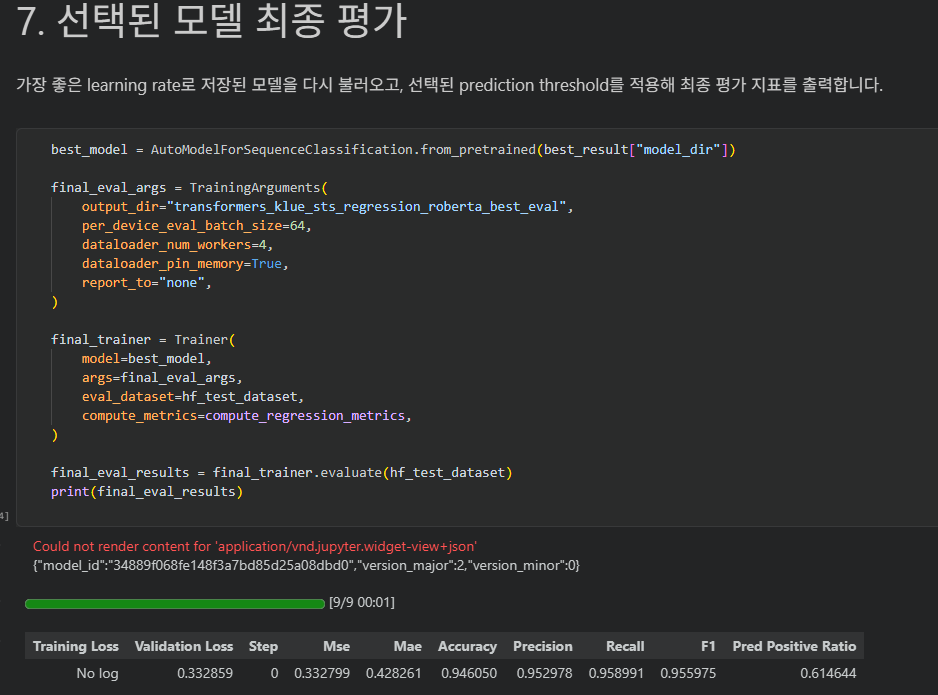
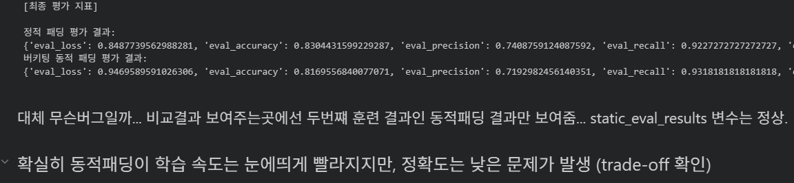
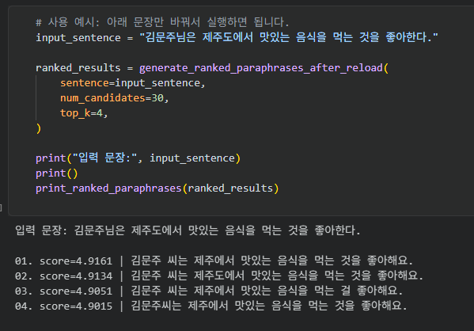

# AIFFEL Campus Online Code Peer Review Templete
- 코더 : 코더의 이름을 작성하세요.
- 리뷰어 : 리뷰어의 이름을 작성하세요.


# PRT(Peer Review Template)
- [x]  **1. 주어진 문제를 해결하는 완성된 코드가 제출되었나요?**
#### 테스트셋 정확도 94%
    
#### Bucketing 적용/미적용시 학습속도와 정확도에서 trade-off 관계 확인.
    이 예제는 전체 데이터가 15000개였고 전체데이터가 훨씬많은경우 정확도는 더 작게줄고 학습속도는 더 크게 늘어나는 효율성 차이를 보였음.
    
    
- [x]  **2. 전체 코드에서 가장 핵심적이거나 가장 복잡하고 이해하기 어려운 부분에 작성된 
주석 또는 doc string을 보고 해당 코드가 잘 이해되었나요?**
    Encoding Only은 Bert-base 모델학습후 유사문장 확인하던 모델을 qwen3.5-4b모델로 베이스 모델로 바꾸면서.
    유사 문장을 만들어내는 모델로 변신시키고 실제 동작도 잘하는 모습을 보여줌.
    
        
- [x]  **3. 에러가 난 부분을 디버깅하여 문제를 해결한 기록을 남겼거나
새로운 시도 또는 추가 실험을 수행해봤나요?**
    - 과정을 모두 남겼지만 에러가 크게 없었음.
        
- [x]  **4. 회고를 잘 작성했나요?**
    노트북 파일이 여러개라서 회고를 블로그에 작성함.
    https://blog.kggstudio.com/huggingface-model-customize/
    
        
- [x]  **5. 코드가 간결하고 효율적인가요?**
    - 파이썬 스타일 가이드 (PEP8) 를 준수하였는지 확인
    - 코드 중복을 최소화하고 범용적으로 사용할 수 있도록 함수화/모듈화했는지 확인
        - 중요! 잘 작성되었다고 생각되는 부분을 캡쳐해 근거로 첨부


# 회고(참고 링크 및 코드 개선)
```
# 리뷰어의 회고를 작성합니다.
# 코드 리뷰 시 참고한 링크가 있다면 링크와 간략한 설명을 첨부합니다.
# 코드 리뷰를 통해 개선한 코드가 있다면 코드와 간략한 설명을 첨부합니다.
```
